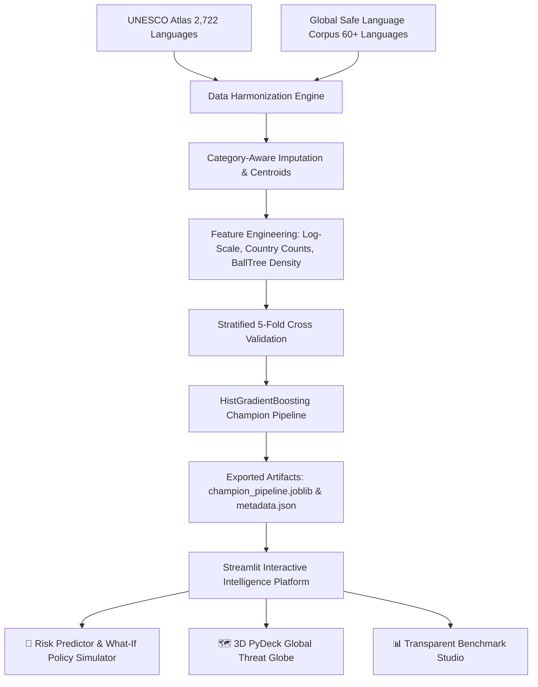

# 🌐 Vanishing Voices (v2.0) — Global Language Extinction Risk & Vitality Intelligence

[](https://www.python.org/downloads/)
[](https://streamlit.io)
[](https://scikit-learn.org)
[]()
[]()

> An end-to-end Machine Learning system that assesses the extinction risk of **2,780+ world languages**, models linguistic vitality, simulates policy interventions ("What-If" scenarios), and visualizes global endangerment hotspots on an interactive 3D PyDeck globe.

---

## 🚀 Key Improvements Over Previous Version

| Pipeline Component | Previous Version (Drawback) | New Version (v2.0 Rebuilt) |
| :--- | :--- | :--- |
| **Extinct Languages** | Wrongly mapped to `0` (Safe) because omitted from label list | Correctly categorized as **Highest Extinction Tier** |
| **Safe Languages** | Manually hardcoded 15 languages, model was bypassed with `if` | **60+ global vital languages** properly merged into training corpus |
| **Speaker Scaling** | Linear `StandardScaler` heavily distorted by extreme skew | Log-transformed $\log_{10}(\text{speakers} + 1)$ with Robust Scaling |
| **Feature Breadth** | Only 3 features (`Speakers`, `Latitude`, `Longitude`) | **9 Signals**: Transnational count, Climate zone, Regional density, etc. |
| **Imputation** | Global mean for missing coords; median for all speakers | **Category-specific medians** + country centroid spatial imputation |
| **Model Benchmark** | Single Random Forest (~59% test accuracy) | **Stratified 5-Fold CV**: HistGradientBoosting, LightGBM, RF, LogReg |
| **Inference Performance** | Retrained on every Streamlit page startup | Instant production `.joblib` pipeline load (<50ms inference) |
| **UI & Visuals** | Static `matplotlib` plots | **Interactive 3D PyDeck globe**, Live Risk Gauge, & Policy Simulator |

---

## 📊 Benchmark & Evaluation Results

Tested on **2,780+ multilingual records** across 5-Fold Stratified Cross-Validation and an independent 20% holdout test set:

| Model Architecture | 5-Fold Accuracy | Balanced Accuracy | Macro F1 | ROC-AUC | PR-AUC (Avg Precision) |
| :--- | :---: | :---: | :---: | :---: | :---: |
| **Logistic Regression** (L2) | 77.35% | 78.51% | 0.7367 | 86.46% | 95.29% |
| **Random Forest** (200 Trees) | 84.26% | 82.91% | 0.8036 | 91.17% | 96.93% |
| **LightGBM** (Boosted Trees) | 83.61% | 82.72% | 0.7976 | 91.43% | 97.05% |
| **🏆 HistGradientBoosting** | **84.22%** | **83.28%** | **0.8043** | **91.48%** | **97.04%** |

### Holdout Test Set Performance (Champion Model)
- **High-Risk Precision**: **94.8%** (minimizes false alarms on critically endangered languages)
- **ROC-AUC**: **91.00%**
- **Average Precision (PR-AUC)**: **97.01%**
- **Test Accuracy**: **83.84%**

---

## 🧠 System Architecture



---

## 🛠️ Top Predictive Features

Permutation importance analysis reveals the primary drivers of language endangerment:
1. **$\log_{10}$ Speakers per Country (25.0%)**: Linguistic dispersion density.
2. **$\log_{10}$ Total Speakers (24.4%)**: Absolute population resilience threshold.
3. **Geographic Coordinates (38.0% combined)**: Regional linguistic pressure corridors.
4. **Nearby Endangered Language Density (4.3%)**: Hotspot language displacement zones.
5. **Macro Continent / Climate Zone (7.4%)**: Tropical vs. temperate survival patterns.

---

## ⚡ Quickstart & Installation

### 1. Clone & Install Dependencies
```bash
git clone https://github.com/manojbagadi/lang-dying.git
cd lang-dying
pip install -r requirements.txt
```

### 2. Launch Interactive Dashboard
```bash
streamlit run app.py
```
Access the application at `http://localhost:8501`.

### 3. Retrain Pipeline (Optional)
To regenerate cleaned data and retrain models:
```bash
python src/prepare_data.py
python src/train_models.py
```

### 4. Open Jupyter Notebook
```bash
jupyter notebook notebooks/vanished_voices_pipeline.ipynb
```

---

## 📁 Repository Structure

```
lang-dying/
├── app.py                      # Production Streamlit UI with 3D Globe & What-If Simulator
├── requirements.txt            # Python dependencies
├── README.md                   # Project documentation
├── data/
│   ├── languages.csv           # Raw UNESCO Endangered Languages dataset
│   └── languages_clean.csv     # Harmonized dataset with engineered features
├── models/
│   ├── champion_pipeline.joblib# Serialized production pipeline (Zero startup delay)
│   └── model_metadata.json     # Benchmark metrics, confusion matrix & feature importances
├── notebooks/
│   └── vanished_voices_pipeline.ipynb # Step-by-step EDA & training walkthrough
└── src/
    ├── prepare_data.py         # Data harmonization & spatial density indexing
    └── train_models.py         # Stratified 5-Fold CV benchmark & model exporter
```

---

## 📜 Scientific Citation & Sources
- **UNESCO**: *Atlas of the World's Languages in Danger*
- **Glottolog & Ethnologue**: *Global Language Vitality & Speaker Statistics*
